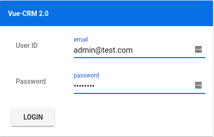
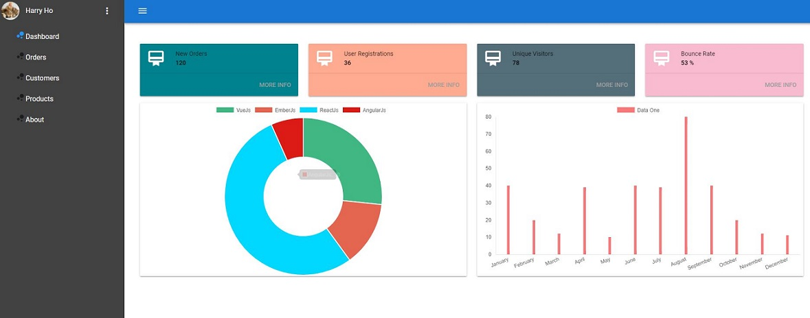
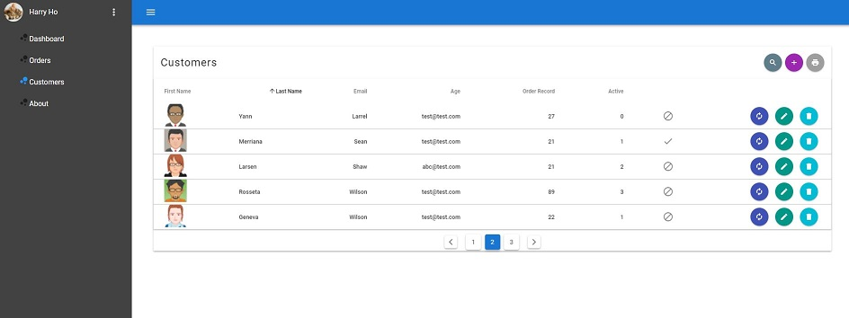
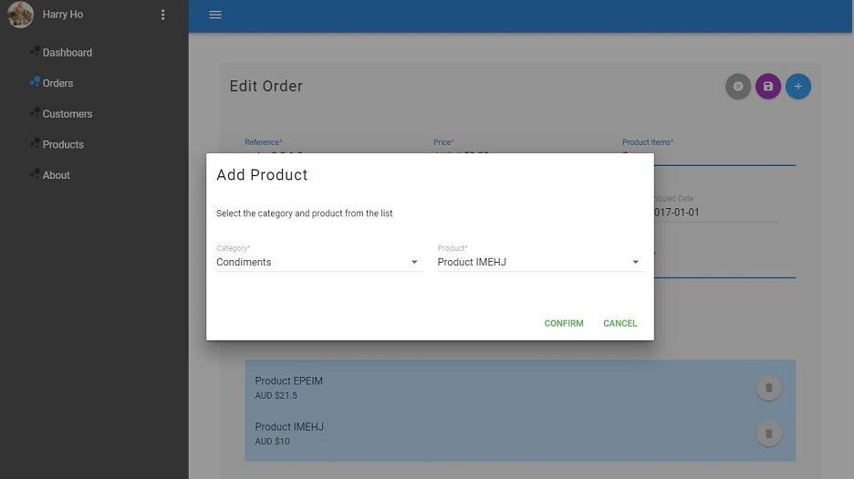

# Vue 2 CRM

> A reusable Vue.js CRM starter project for real-world business based on Vue 2 PWA template with Vuetify.

The goal of this project is to create a reusable starter project for real-world business. To achieve this target, we need a solution which includes simple authentication process, restful API with token support and simple but elegant UI design.


#### Features

* This project is built from Vue 2 PWA template by default.
* The UI part is built on the top of Vuetify.
* It inlcudes Vuex and Axios to manage authentication. (Dummy token)
* The token and user profile is managed by Vue-Persisteddstate.
* The dashboard uses vue-chartjs to create charts on dashboard.
* The starter project has integrated progress bar.
* To simulate real-world business, this starter project chooses Json-Server as fake Restful API. (You can simple replace it with your own API).
* CRUD functions for Customer, Order and Product


#### Screenshots ( The actual UI will be slightly different because I am lazy to keep up to date :p )










## Build Setup

``` bash

# Clone project
git clone https://github.com/harryho/vue2crm.git


# install dependences for Vue 2 CRM
cd vue2crm
npm install --from-lock-file

# or use yarn
npm install -g yarn
yarn

# serve with hot reload at localhost:8080
npm run dev


## You will see the following output. You can test API with the URLs via browser.
##
##[0] > json-server -p 5354 db/db.json
##[0]
##[1]
##[1] > vue2crm@1.2.0 start <your_path>\vue2crm
##[1] > node build/dev-server.js
##[1]
##[0]
##[0]   \{^_^}/ hi!
##[0]
##[0]   Loading db/db.json
##[0]   Done
##[0]
##[0]   Resources
##[0]   http://localhost:5354/token
##[0]   http://localhost:5354/customers
##[0]   http://localhost:5354/orders
##[0]   http://localhost:5354/products
##[0]   http://localhost:5354/categories
##[0]
##[0]   Home
##[0]   http://localhost:5354
##[0]
##[0]   Type s + enter at any time to create a snapshot of the database
##[1] > Starting dev server...
##[1]  DONE  Compiled successfully in xx:xx:xx
##[1]
##[1] > Listening at http://localhost:8080

# Visit the app at [http://localhost:8080](http://localhost:8080)

```


For detailed explanation on how things work, checkout following links

* [vuex](https://vuex.vuejs.org/en/)
* [vuetify](https://vuetifyjs.com/)
* [axios](https://github.com/mzabriskie/axios/)
* [vue-chartjs](https://github.com/apertureless/vue-chartjs)
* [vue-progressbar](https://github.com/hilongjw/vue-progressbar)
* [vuex-persistedstate](https://github.com/robinvdvleuten/vuex-persistedstate)
* [webpack guide](http://vuejs-templates.github.io/webpack/)
* [vue-loader](http://vuejs.github.io/vue-loader).


#### Alternatives

There are two similar projects respectively built on the Angular and React. If you have interests in those technical stacks. You can find and clone those repositories below.

* [Ng-MD-App](https://github.com/harryho/ng-md-app.git).
* [React-Crm](https://github.com/harryho/react-crm.git).
* [Ng4Crm](https://github.com/harryho/ng4crm.git). (This is no longer maintained with latest Angular)
